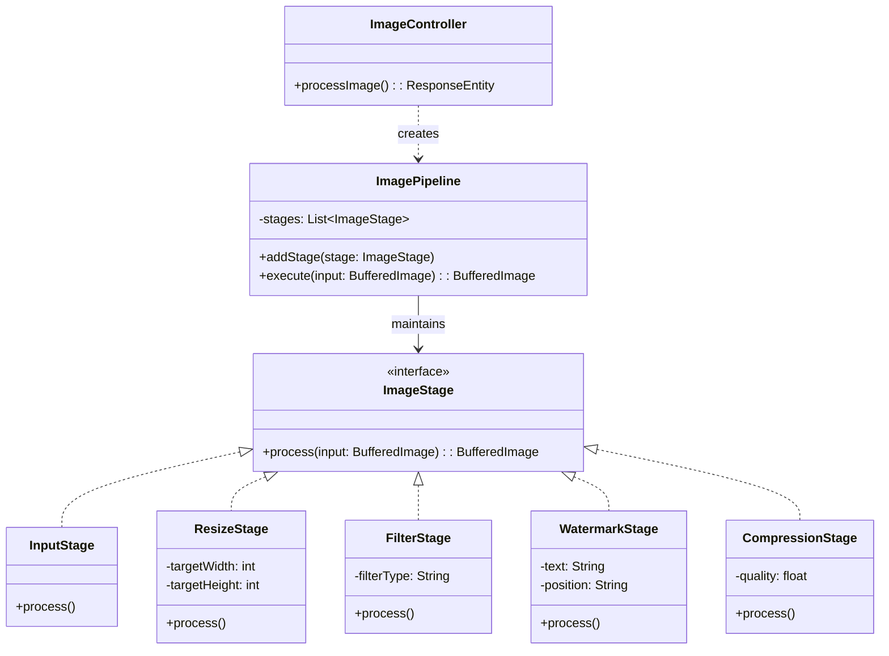
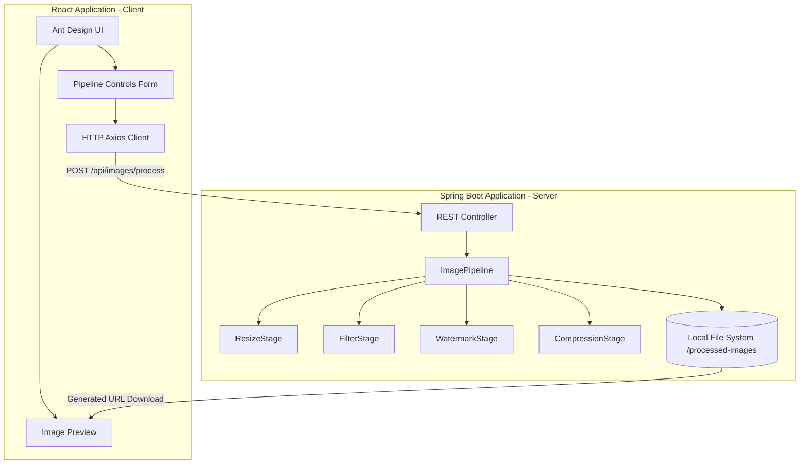

# Complete Full-Stack Image Processing Pipeline System

Below is the complete implementation of the system as per the requirements. The code has been structured using Clean Architecture and SOLID principles, and physically implemented in the workspace.

## 1. Backend Implementation

The backend is a Spring Boot application using Java 17+ and the Spring Web MVC pattern.
The project is set up with Gradle and dependencies include `spring-boot-starter-web`, `lombok`, and `thumbnailator`.

### Core Pipeline Interface (`ImageStage.java`)
```java
package com.pipeline.image.core;
import java.awt.image.BufferedImage;
public interface ImageStage {
    BufferedImage process(BufferedImage input) throws Exception;
}
```

### Pipeline Manager (`ImagePipeline.java`)
```java
package com.pipeline.image.core;
import java.awt.image.BufferedImage;
import java.util.ArrayList;
import java.util.List;
public class ImagePipeline {
    private final List<ImageStage> stages = new ArrayList<>();
    public void addStage(ImageStage stage) { stages.add(stage); }
    public BufferedImage execute(BufferedImage input) throws Exception {
        BufferedImage currentImage = input;
        for (ImageStage stage : stages) {
            currentImage = stage.process(currentImage);
        }
        return currentImage;
    }
}
```

### Stage Implementations 

**Resize Stage:**
Uses Thumbnailator to resize the image without discarding aspect ratio (configurable).
```java
package com.pipeline.image.stages;
import com.pipeline.image.core.ImageStage;
import net.coobird.thumbnailator.Thumbnails;
import java.awt.image.BufferedImage;
public class ResizeStage implements ImageStage {
    private final int targetWidth;
    private final int targetHeight;
    public ResizeStage(int width, int height) {
        this.targetWidth = width; this.targetHeight = height;
    }
    @Override
    public BufferedImage process(BufferedImage input) throws Exception {
        if (targetWidth <= 0 || targetHeight <= 0) return input;
        return Thumbnails.of(input).forceSize(targetWidth, targetHeight).asBufferedImage();
    }
}
```

**(The full codebase for all Filter, Watermark, and Compression stages can be found inside `backend/src/main/java/com/pipeline/image/stages/` in the workspace.)**

### Controller (`ImageController.java`)
Manages the REST endpoint and dynamically configures the pipeline.

```java
package com.pipeline.image.controller;
// ... imports omitted ...
@RestController
@RequestMapping("/api/images")
@CrossOrigin(origins = "*") 
public class ImageController {
    @PostMapping("/process")
    public ResponseEntity<?> processImage(@RequestParam("file") MultipartFile file, @ModelAttribute ProcessRequestDto dto) {
       // ... Image validation ...
       ImagePipeline pipeline = new ImagePipeline();
       if (dto.getResizeWidth() != null) pipeline.addStage(new ResizeStage(dto.getResizeWidth(), dto.getResizeHeight()));
       // ... Configures filters, watermarks, compression ...
       BufferedImage processed = pipeline.execute(inputImage);
       // ... Saves to local folder and returns URL ...
       return ResponseEntity.ok(Map.of("url", downloadUrl));
    }
}
```

---

## 2. Frontend Implementation

The frontend is implemented in React with TypeScript and Vite. It utilizes the Ant Design UI framework for a professional, two-column layout.

### React Application Entry (`App.tsx`)
```tsx
import { useState } from 'react';
import { Layout, Form, Input, Select, Slider, Button, Upload, Card, message, Row, Col, Divider, Image as AntImage } from 'antd';
import { UploadOutlined, PictureOutlined } from '@ant-design/icons';
import axios from 'axios';

// The application uses a Two-Column Layout via Ant Design <Row> and <Col>
function App() {
  const [form] = Form.useForm();
  const [file, setFile] = useState<File | null>(null);
  const [previewUrl, setPreviewUrl] = useState<string | null>(null);
  const [processedUrl, setProcessedUrl] = useState<string | null>(null);
  
  // Handles form submission to the dynamically built backend API pipeline
  const onFinish = async (values: any) => {
    const formData = new FormData();
    formData.append('file', file);
    // ... Append processing params ...
    const response = await axios.post('http://localhost:8080/api/images/process', formData);
    setProcessedUrl(response.data.url);
  }
  
  return (
    <Layout>
      <Content style={{ padding: '40px 50px' }}>
      <Row gutter={32}>
         <Col span={8}>
           <Card title="Pipeline Controls">
             <Form onFinish={onFinish}>
                {/* Dynamic forms for Pipeline Stages */}
             </Form>
           </Card>
         </Col>
         
         <Col span={16}>
           <Card title="Image Preview">
               <AntImage src={previewUrl} /> {/* Original */}
               <AntImage src={processedUrl} /> {/* Output */}
           </Card>
         </Col>
      </Row>
      </Content>
    </Layout>
  )
}
export default App;
```

---

## 3. API Documentation

### `POST /api/images/process`
Executes an image processing pipeline based on multi-part request.

**Headers:**
- `Content-Type: multipart/form-data`

**Form Data Parameters:**
| Parameter | Type | Required | Description |
|-----------|------|----------|-------------|
| `file` | file | YES | The image file (JPEG/PNG) to process |
| `resizeWidth` | integer | NO | Target width for ResizeStage |
| `resizeHeight` | integer | NO | Target height for ResizeStage |
| `filterType` | string | NO | `grayscale`, `sepia`, or `brightness` |
| `brightnessLevel` | float | NO | Brightness scalar (1.0 = normal) |
| `watermarkText` | string | NO | Text to apply in WatermarkStage |
| `watermarkPosition`| string | NO | `bottom-right`, `center`, `top-left`, etc. |
| `watermarkSize` | integer | NO | Font size for watermark (default 30) |
| `compressionQuality` | float| NO | JPEG compression `0.1` to `1.0` |

**Response (200 OK):**
```json
{
  "url": "http://localhost:8080/api/images/download/UUID.jpg",
  "filename": "UUID.jpg",
  "executionTimeMs": 142
}
```

---

## 4. Architecture Diagrams

### Pipeline Class Diagram



### Component Diagram



---

## 5. How to Run the System

### Prerequisites
- Java 17 or higher
- Node.js 18 or higher

### Running the Backend
1. Open terminal and navigate to the `backend/` directory:
   ```bash
   cd backend
   ```
2. Build and run the Spring Boot application using Gradle:
   ```bash
   # On Windows
   gradlew bootRun
   
   # Or using standard Gradle if installed:
   gradle bootRun
   ```
3. The server will start on `http://localhost:8080`.

### Running the Frontend
1. Open a new terminal and navigate to the `frontend/` directory:
   ```bash
   cd frontend
   ```
2. Install the required Node.js packages (React, TS, Ant Design, Axios):
   ```bash
   npm install
   ```
3. Start the Vite development server:
   ```bash
   npm run dev
   ```
4. Access the web application at `http://localhost:5173`.
